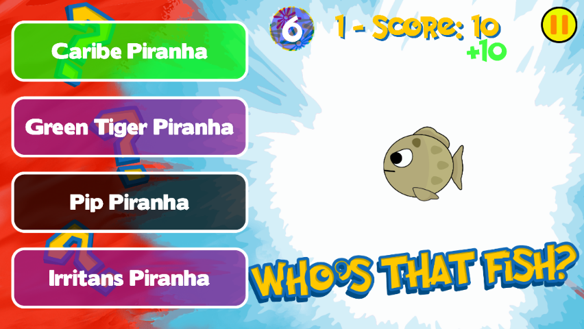
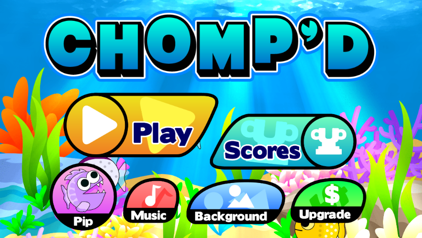

# JKButtonNode: Buttons for SpriteKit

## Preface

The JKButtonNode class is a custom class built by me that introduces buttons into SpriteKit games. If you have ever worked on one, you will see that SpriteKit does not have its own built in button nodes. Instead, what many people do, is they create a regular sprite and then just call containsPoint on the sprite to detect when the user has pressed it. This class solves that issue and implements a similar system used by UIButton node to prevent extra and unnecessary code.

This screenshot is from the quiz game mode of my Chomp'd game. Notice the 4 buttons to the left. They are all JKButtonNodes with titles. Because it's a quiz, the titles must change with each new question. I'm only using 4 objects as opposed to having 8 if I didn't use my JKButtonNode class.
  

## Introduction

A JKButtonNode is composed of an SKSpriteNode and an SKLabelNode. This combination has several benefits:

- It allows you to call any familiar properties and methods you already know without having to learn anything new.
- Allows you to set titles for buttons and even change them later. Works great for quizzes.
- Uses a single variable declaration rather than you creating an SKSpriteNode and an SKLabelNode and attaching them to each other. That means you only have to worry about 1 object and not 2.
- Prevents unnecessary code in the touch functions because the call when the button is pressed does not require the SKScene touch functions at all.
- Code becomes organized as you can keep all of your button functions separated from the rest of the class.

#### Button States
Unlike UIButtons, JKButtonNode only has 3 different button states: normal, highlighted, and disabled. Normal is the default button look when there are no interactions. Highlighted is how the button looks when it has been pressed but the touch has not been released yet, and disabled is how the buttons looks when the user can't interact with it. JKButtonState is an enumeration declared in the class as follow:

````
enum JKButtonState {
  case normal
  case highlighted
  case disabled
}
````

## How to Start
First, just go to the Project directory, and then the JKButtonNode folder, and the JKButtonNode.swift file will be in there. Just add the Swift file to your project and that's it. If you want to just quickly look at it, download the entire project and run it.

### 1. Declaring a Button
Declaring a button is as easy as declaring any other object. Because users can have specific uses for buttons (with/without titles, etc.), there are several initializers, but here's a basic one. If you know the button will need to be accessed by the entire SKScene class, then make sure to make them global within the class.

````
var newGameButton = JKButtonNode(title: "New Game", state: .normal)
````

### 2. Assigning its Action
The action is the function that is called when the user has successfully pushed the button and released their touch. The action will not be called if the user touches the button but then moves their finger off the button's frame. First, declare a function with whatever name you want but make sure its parameters are the same as: **button: JKButtonNode**.

````
func newGameAction(button: JKButtonNode) {
  //This is called when the button has been pressed.
}
````
To connect the action with the button, simply call the button's action property.

````
newGameButton.action = newGameAction
````
You can actually use your own custom actions instead of declaring a function. Just set the buttons **useCustomAction** property and set it to true. I used this for my quiz game mode in Chomp'd because when an answer choice was pushed, I needed a complex algorithm to run depending on what button they pressed.

### 3. Assign the Button's Properties
Because buttons have a lot of different behaviors, they also have a lot of different properties you can set. For example, what sounds will it play when the user touches the button, what backgrounds it will have for its different states, etc. Here are the most helpful functions you can call on the buttons.

**setBackgroundForStates**: Call this function on the button. This will allow you to assign the 3 backgrounds for each state of the button. If you don't want a button to be able to change state, then set **canChangeState** to false.
````
newGameButton.setBackgroundsForState(normal: "ButtonNormal", HomeButtonNormal: "ButtonHighlighted", disabled: "ButtonDisabled")
````
**setSoundsFor**: Call this method to specify what sounds to play when the user pushes the button successfully or when they attempt to push a button that's disabled. You can also disable sounds by calling **canPlaySounds** and setting it to false. Alternatively, you can set each one specific by calling the **normalSound** and **disabledSound** properties.
````
newGameButton.setSoundsFor(normalButton: "PushedSound", andDisabledButton: "DisabledSound")
````
**setPropertiesForTitle**: If your button has a title, then simply call this function to change the title properties, such as the font size, color, and font.
````
newGameButton.setPropertiesForTitle(fontName: "Monofur", size: 50, color: UIColor.whiteColor())
````
For individual changes, then call the button's title property (which it derives from the SKLabelNode attached to the button).
````
newGameButton.title.text = "New Quest"
newGameButton.title.fontColor = UIColor.redColor()
````
**setProperties**: If you have several buttons that will have the same properties (such as 4 quiz game show buttons), then you can call this function to assign multiple properties at once. It's more effective if you have an array of buttons and then call forEach on the array.
````
button1.setProperties(enabled: true, canPlaySound: true, canChangeState: false, withSounds: (normal: "NormalSound", disabled: "DisabledSound"))
````
### Additional Notes
If you need help, just look at the code from the project on how you can create various buttons with unique properties or email me at [jozemite@gmail.com](jozemite@gmail.com). The following is a screenshot of my Chomp'd game that also uses the same button class. Note that the titles of those buttons are not an SKLabelNode. These are examples of buttons without titles.
 
